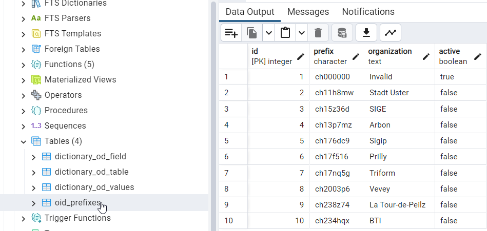
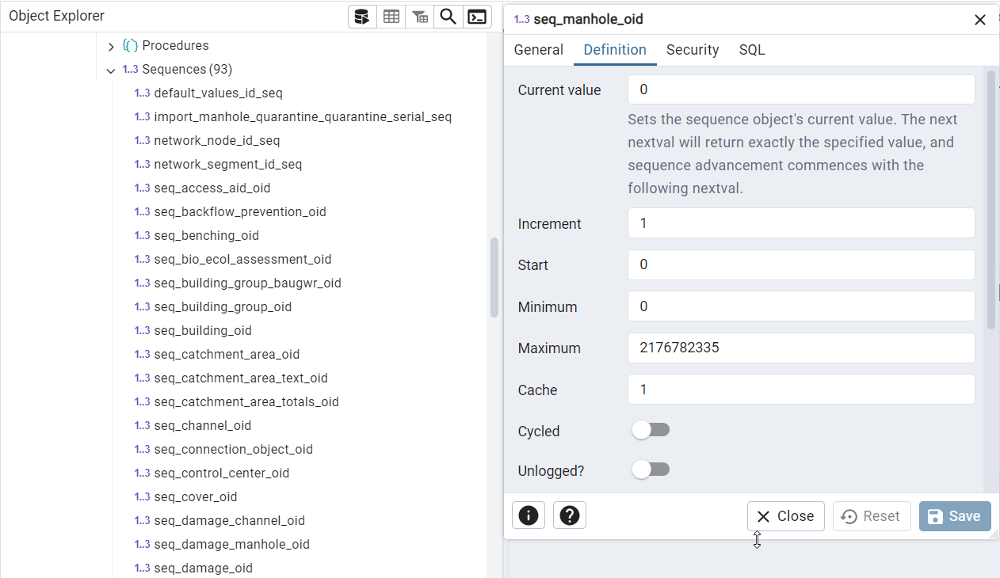

.. _production_readiness:

Prepare database for production
===============================

OID Prefix Settings
-------------------

To prepare the database to be production ready change the active demo prefix (ch000000) in the tww_sys.oid_prefixes table to your project prefix. If needed add your project prefix to that table first. Make sure only one prefix is set to active.

Else the new 'Database production ready check' will throw a WARNING.

.. versionadded:: 2026.0

The OID Prefix can be set in TMMT from 2026.0.1 on

Obj_ID in the TEKSI Wastewater Module (TWW)
-------------------------------------------

TWW creates obj_id's (which will become the OID in the INTERLIS export file) according to the following pattern:
* Positions 1-8: Prefix for all new records in the database, defined in tww_sys.oid_prefixes
* Positions 9, 10: Shortcut of the class, defined in tww_sys.dictionary_od_table.shortcut_en
* Positions 11-16: Sequence number, defined for each class in tww_od sequences

These sequences store the next available sequential number for each class.

What happens when new data is imported?
* If the new data uses the same OID prefix as the OID prefix in the database, then the sequences must be updated. TWW does this automatically after the data import. The user does not need to do anything.
* If the new data uses a different OID prefix than the selected OID prefix in the database, then the sequences do not need to be updated.

What happens if the OID prefix in `tww_sys.oid_prefixes` is changed and data already exists in the database?
* If the existing data already uses the new OID prefix, the sequences must be updated. TWW does this automatically after saving the new OID prefix.
* If the existing data does not use the new OID prefix, the sequences must be reset so that the counter starts at 0 again with the new prefix. TWW does not perform this reset automatically.

To do: A function will be programmed to manually trigger the sequence reset.

Setting Default Values
----------------------

See :ref:`settingdefaultvalues` in the User Guide - How to Chapter
