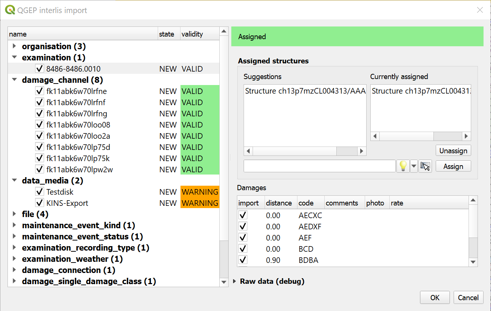

INTERLIS Data exchange
======================

This represents a guide on how to import/export data between TWW and INTERLIS 2 Transfer Format (XTF).

General
^^^^^^^^^^^^^

The TWW plugin includes an INTERLIS import/export feature.
It is currently capable of importing and exporting the following models::
* SIA405_ABWASSER_2020_1_LV95
* DSS_2020_1_LV95
* VSA_KEK_2020_1_LV95

Note that currently, exports are possible in German only. Translated exports are on the roadmap, let us know if you are interested in this feature.

Prerequisites
^^^^^^^^^^^^^^

Java
--------
You need java on your system.

Windows : `Java for windows download <https://javadl.oracle.com/webapps/download/AutoDL?BundleId=245058_d3c52aa6bfa54d3ca74e617f18309292>`_
MacOS : `Java for MacOS download <https://javadl.oracle.com/webapps/download/AutoDL?BundleId=245051_d3c52aa6bfa54d3ca74e617f18309292>`_
Linux : use the package manager

Python libraries
-----------------
You need `sqlalchemy` and `geoalchemy2`.

To install : before launching QGIS, open OSGeo4W Shell

.. figure:: images/osgeo4wshell.jpg

and type::

   >>> pip3 install "sqlalchemy~=1.3.22" "geoalchemy2>=0.9.0"

If the command fails, try::

   >>> pip3 install --upgrade pip

.. note:: If pip cannot be found, make sure you’ve installed the python3-pip package using the OSGeo4W network installer (if you’ve installed the standalone version of QGIS, it should be included).

If this command still fails, try::

  >>> pip3 install --target=c:\somewhere\other\than\the\default --upgrade pip

where ``c:\somewhere\other\than\the\default`` is the path to your current pip package

The same `--target` flag can be added to install `sqlalchemy` and `geoalchemy2` in another location.

TWW Version
-------------
The export only supports up-to-date TWW datamodel (2024.0 at the time of writing). Ensure your datamodel is fully updated before trying to import/export.

Usage (GUI)
^^^^^^^^^^^^^

Enable admin mode
-------------------------------------------------

In the `plugin>TWW>settings` dialog, under the `Developer options` tab, ensure `Admin mode` is enabled. Restart QGIS.

You should now see new `import` and `export` buttons in the TWW toolbar.

.. figure:: images/toolbar.png

Export
-------------------------------------------------

To export your TWW data, click on the `export` button. The following dialog will appear.

At first, select the export model.

If you have an active selection in the nodes and/or reaches layer, you can choose to restrict the export to that selection. This is especially useful in combination with the upstream/downstream selection tools.

.. figure:: images/tww_interlis_export_selection.png

The export tools is capable of exporting label positions for different scales. You can choose which scales you are interested in exporting by selected/deselecting them.

Then, confirm the dialog and choose where to save the `.xtf` file.

.. note:: Note that windows file pathes with empty strings in the directory path or filename are not supported at the moment.

.. note:: Note that for large/full exports, the command can take a long time.

.. note:: Note that QGIS standard behaviour for too long labels is to turn them horizontally (orientation = 0). You can adjust the properties of the vw_tww_reach layer - Symbology - Placement - Label overrun from "no overrun" to e.g. 7 mm (Millimeter)

.. figure:: images/layer_vw_tww_reach_label_overrun.png

.. note:: Note that remark fields are truncated to 80 characters on INTERLIS Export, as the INTERLIS definition is like this. If you have remark fields with more text then consider to move this data to documentation with the classes "file" and "data_media" so it can be exported to INTERLIS completely where you can add any document, photo or video to a class.

Exports include a validation step using `ilivalidator`, which will inform you whether the export contains validation error.

Import
-------------------------------------------------

To import `xtf`files, click on the `import` button and navigate to the `.xtf` file.

.. note:: Note that windows file pathes with empty strings in the directory path or filename are not supported at the moment.

.. note:: Starting with Release 2020 all organisations are in a separated dataset and need to be imported first, else a bunch of errors will be thrown on all references like fk_dataowner, fk_owner, fk_provider, etc. Download the VSA Organisation data set from https://www.vsa.ch/models/organisation/vsa_organisationen_2020_1.xtf and start with importing that data set. This data set is updated regularly - so please come back and check (and maybe re-import) at a later stage to have access to all available organisation.

If you have organisations that are not yet in that data set `please inform the VSA and hand in an application to be added <https://vsa.ch/fachbereiche-cc/siedlungsentwaesserung/generelle-entwaesserungsplanung/datenmanagement/#Organisationstabelle>`_.

If you have additional own local organisations that are not (yet) in the VSA organisation data set continue with importing those before you start importing your network data. TV inspection data usually comes last, as it references your network data.

After launching the import process your data set will be validated and imported in a intermediatary schema. Then the following dialog will appear.

The left part of this dialog lists all elements that are going to be imported from the `.xtf` file, allowing to review what is going to be imported and to deselect elements you may want to skip. It also shows the validation status of each object, showing whether further action is needed (INVALID) or recommended (WARNING) prior to importing.

The right part of this dialog shows a form specific to the type of element selected in the list, allowing to adapt the import.

.. note:: Currently de-selecting and selecting objects might take a long time depending how many data sets are in that respective class.

.. note:: Special feature for TV Inspection import: For instance, it allows to attach "examinations" to their pipes.

Once you're happy with the import options, confirm the dialog to persist the changes to your database.

Usage (command line)
^^^^^^^^^^^^^^^^^^^^^^

For advanced usage, the import/export tool can also be used as a command line tool.

Dependencies
--------------

The QGIS python classes must be available in the python interpreter.

* On windows you can use the OSGeo4W environment
* On linux you can extend the PYTHONPATH pointing to you QGIS installation, for example: `export PYTHONPATH="$PYTHONPATH:/usr/share/qgis/python"`

Import
--------

Import example

.. code-block:: shell-session

   $ python3 plugin/tww_cmd.py interlis_import --xtf_file plugin/teksi_wastewater/tests/data/minimal-dataset-SIA405-ABWASSER.xtf --pgservice pg_tww

Full usage

.. code-block:: shell-session

   $ python3 plugin/tww_cmd.py interlis_export --help

   usage: tww_cmd.py interlis_export [-h] --xtf_file XTF_FILE [--selection SELECTION] [--export_model {SIA405_ABWASSER_2020_1_LV95,DSS_2020_1_LV95,VSA_KEK_2020_1_LV95}] [--logs_next_to_file]
                                                  [--label_scale_pipeline_registry_1_1000] [--label_scale_network_plan_1_500] [--label_scale_overviewmap_1_10000] [--label_scale_overviewmap_1_5000]
                                                  [--label_scale_overviewmap_1_2000] [--selected_ids SELECTED_IDS] [--pgservice PGSERVICE] [--pghost PGHOST] [--pgport PGPORT] [--pgdatabase PGDATABASE]
                                                  [--pguser PGUSER] [--pgpass PGPASS]

   options:
     -h, --help            show this help message and exit
     --xtf_file XTF_FILE   XTF outup file
     --selection SELECTION
                           if provided, limits the export to networkelements that are provided in the selection (comma separated list of ids)
     --export_model {SIA405_ABWASSER_2020_1_LV95,DSS_2020_1_LV95,VSA_KEK_2020_1_LV95}
                           Model to export (default: DSS_2020_1_LV95)
     --logs_next_to_file   Put log files next to XTF output file
     --label_scale_pipeline_registry_1_1000
                           Export labels in scale 1:1'000, can be combined with other scales (Leitungskataster/Cadastre des conduites souterraines)
     --label_scale_network_plan_1_500
                           Export labels in scale 1:500, can be combined with other scales (Werkplan/Plan de reseau)
     --label_scale_overviewmap_1_10000
                           Export labels in scale 1:10'000, can be combined with other scales (Uebersichtsplan/Plan d'ensemble)
     --label_scale_overviewmap_1_5000
                           Export labels in scale 1:5'000, can be combined with other scales (Uebersichtsplan/Plan d'ensemble)
     --label_scale_overviewmap_1_2000
                           Export labels in scale 1:2'000, can be combined with other scales (Uebersichtsplan/Plan d'ensemble)
     --selected_ids SELECTED_IDS
                           If provided, limits the export to networkelements that are provided in the selection (comma separated list of ids)
     --pgservice PGSERVICE
                           Postgres service name
     --pghost PGHOST       Postgres host
     --pgport PGPORT       Postgres port
     --pgdatabase PGDATABASE
                           Postgres database
     --pguser PGUSER       Postgres user
     --pgpass PGPASS       Postgres password

Export
--------

Export example

.. code-block:: shell-session

   python3 plugin/tww_cmd.py interlis_export --xtf_file "output.xtf" --pgservice pg_tww

Full usage

.. code-block:: shell-session

   $ python3 plugin/tww_cmd.py interlis_export --help

   usage: tww_cmd.py interlis_export [-h] --xtf_file XTF_FILE [--selection SELECTION] [--export_model {SIA405_ABWASSER_2020_1_LV95,DSS_2020_1_LV95,VSA_KEK_2020_1_LV95}] [--logs_next_to_file]
                                                  [--label_scale_pipeline_registry_1_1000] [--label_scale_network_plan_1_500] [--label_scale_overviewmap_1_10000] [--label_scale_overviewmap_1_5000]
                                                  [--label_scale_overviewmap_1_2000] [--selected_ids SELECTED_IDS] [--pgservice PGSERVICE] [--pghost PGHOST] [--pgport PGPORT] [--pgdatabase PGDATABASE]
                                                  [--pguser PGUSER] [--pgpass PGPASS]

   options:
     -h, --help            show this help message and exit
     --xtf_file XTF_FILE   XTF outup file
     --selection SELECTION
                           if provided, limits the export to networkelements that are provided in the selection (comma separated list of ids)
     --export_model {SIA405_ABWASSER_2020_1_LV95,DSS_2020_1_LV95,VSA_KEK_2020_1_LV95}
                           Model to export (default: DSS_2020_1_LV95)
     --logs_next_to_file   Put log files next to XTF output file
     --label_scale_pipeline_registry_1_1000
                           Export labels in scale 1:1'000, can be combined with other scales (Leitungskataster/Cadastre des conduites souterraines)
     --label_scale_network_plan_1_500
                           Export labels in scale 1:500, can be combined with other scales (Werkplan/Plan de reseau)
     --label_scale_overviewmap_1_10000
                           Export labels in scale 1:10'000, can be combined with other scales (Uebersichtsplan/Plan d'ensemble)
     --label_scale_overviewmap_1_5000
                           Export labels in scale 1:5'000, can be combined with other scales (Uebersichtsplan/Plan d'ensemble)
     --label_scale_overviewmap_1_2000
                           Export labels in scale 1:2'000, can be combined with other scales (Uebersichtsplan/Plan d'ensemble)
     --selected_ids SELECTED_IDS
                           If provided, limits the export to networkelements that are provided in the selection (comma separated list of ids)
     --pgservice PGSERVICE
                           Postgres service name
     --pghost PGHOST       Postgres host
     --pgport PGPORT       Postgres port
     --pgdatabase PGDATABASE
                           Postgres database
     --pguser PGUSER       Postgres user
     --pgpass PGPASS       Postgres password

Quality control
^^^^^^^^^^^^^^^^

Quality control with VSA online checker (Fachprüfung mit VSA Checker (online))
-----------------------------------------------------------------------------------

.. figure:: https://vsa.ch/wp-content/uploads/2020/04/Daten-checker-d-f-it.jpg

`For details see explanation on the VSA Homepage <https://vsa.ch/fachbereiche-cc/siedlungsentwaesserung/generelle-entwaesserungsplanung/datenmanagement/#GEP-Datachecker>`_

`Information about access and licensing you can get here <https://vsa.ch/Mediathek/gep-datachecker-jahresgebuehr/?media_filter_two=lizenzen-software>`_
