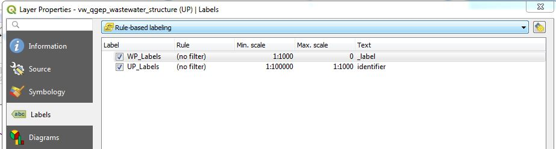
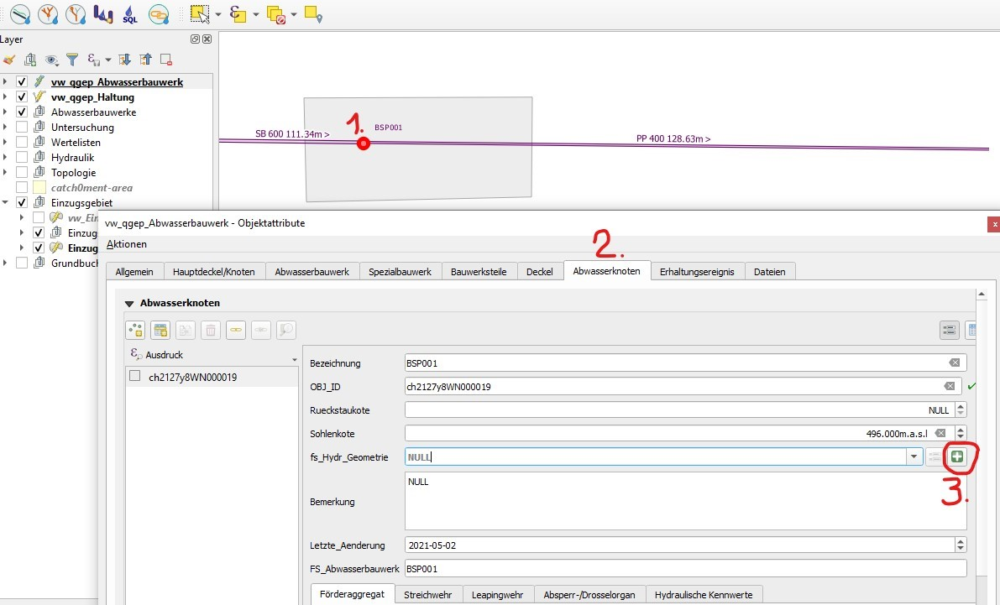
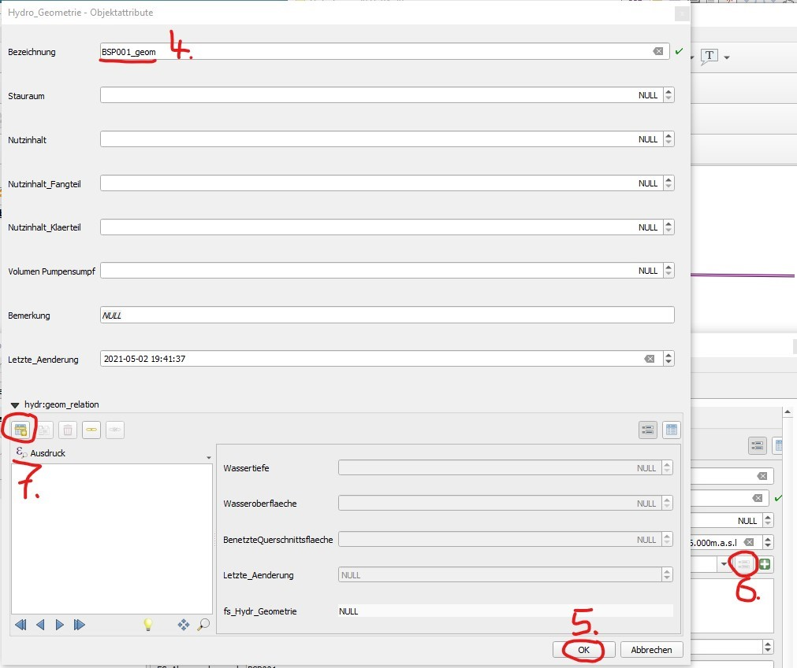
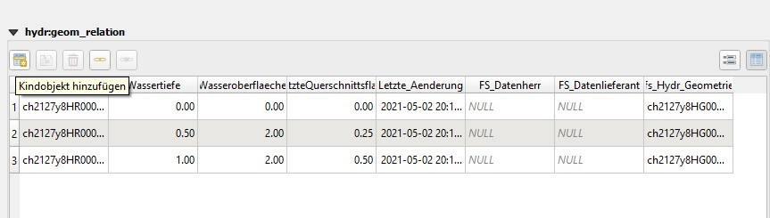
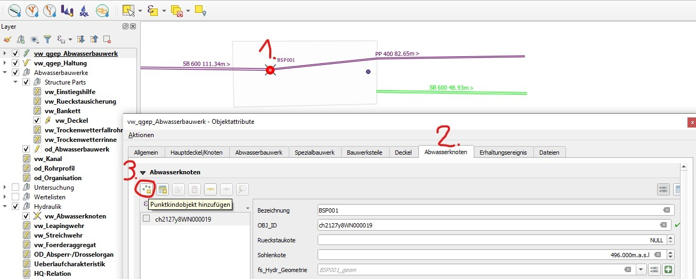
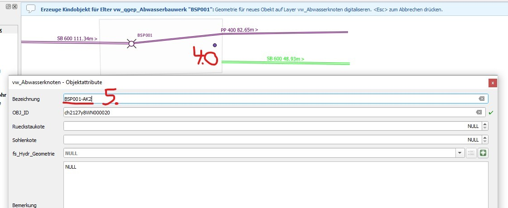
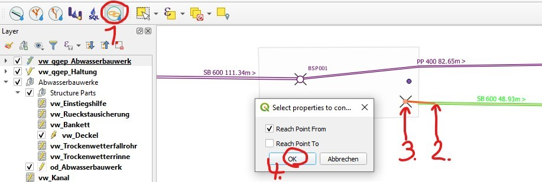
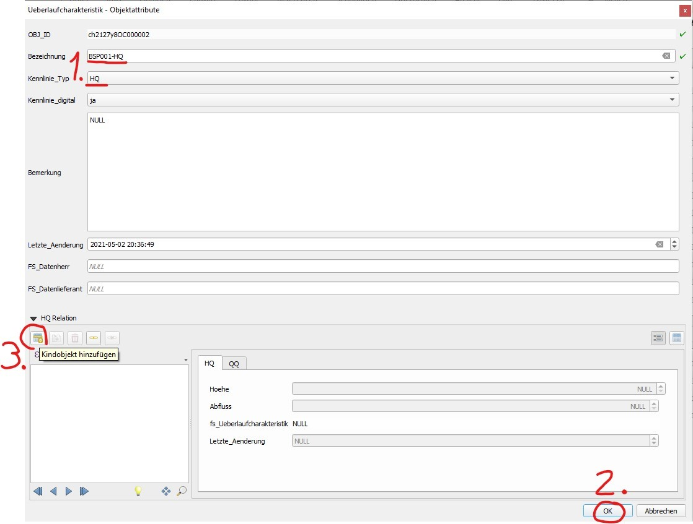

How To
======

This represents a guide on different themes about configuring in TWW.

.. _settingdefaultvalues:

Setting default values
-----------------------

If you get the following error message on startup of the TEKSI project during the 'Database production ready check':

.. attention::
CRITICAL: Error fk_provider or fk_dataowner not set in tww_od.default_values

then your database is not yet production ready.

It is possible to define default values for repeated fields such as fk_provider or fk_dataowner, so that you not have to add those manually for each object that you are creating.

There is a new layer group 'configuration' in the project:

.. figure:: images/configuration_default_values.png

1. Open the attribute table 'Default values'
2. Change to edit mode and choose select new object
3. Select field name (currently fk_dataowner and fk_provider are supported in the form)

.. figure:: images/default_values_fieldname_selection.png

4. Select organisation that should be used (the corresponding obj_id will be added in the table itself).

.. figure:: images/default_values_organisation_obj_id_selection.png

For the second warning, please contact your TEKSI system administrator

.. attention::
CRITICAL: Error OID prefix set to 'ch000000'. Database not safe for production.

and ask him/her to set the prefix to fit your project.

For more information see :ref:`productionreadiness`

Connect all occurences of your field name to ``tww_sys.get_default_values(field_name)``.
Per default, the fields ``fk_provider`` and ``fk_dataowner`` are already connected to the function ``tww_sys.get_default_values(field_name)``.

An example SQL script how to insert the default value for all occurences of a field name can be found `here <https://github.com/teksi/wastewater/blob/main/datamodel/changelogs/0001/14_default_values.sql>`_)

How vw_tww_wastewater_structure labels work
-------------------------------

Labeling a manhole with his levels is quite a complex thing. Levels are not stored in the wastewater_structure class itself, but in the cover table and as reachpoint levels with the connected reaches. TWW has therefore 4 calculated fields to be able to label these levels:

- _cover_label: shows the level / the levels of the cover/s.level of the wastewater structure
- _bottom_label: shows the level / the levels of the wastewater_node(s).bottom_level of the wastewater structure
- _input_label: shows the levels of the reachpoints connected as to_reachpoints to one of the wastewater_nodes of the wastewater_structure
- _output_lebel: shows the levels of the reachpoints connected as from_reachpoints to one of the wastewater_nodes of the wastewater_structure

.. figure:: images/tww_labels.jpg

In this example, there are 4 input-reaches to the manhole, but there are only two input-labels (I1, I2). Why?

Answer: in the function, where the _input_label is calculated, can be set a filter so that only reaches with specified function_hierachic (e.g. only pwwf-reaches) are labeled (uses a specific field in the vl-channel_function_hierarchic, documentation follows).
In the example, the 200mm-reaches are swwf-reaches and therefore not labeled.

Which reach is I1, which is I2?

Answer: TWW uses the azimut of the last segment of the reach (for inputs) or the first segement of the reach (for outputs) to define the order of the labels. If you stand in the North to the manhole and go clockwise around the manhole, you will first come to I1 and then later to I2.
In the example, 300 combined-wastewater-reach is I1, 400 wastewater-reach is I2.

How to translate a label prefix (C, B, I, O)
--------------------------------------------

To easily translate label prefixes a series of QGIS project variables have been added. If you want to change the prefixes for cover level, bottom level and entry and exit levels, change the following project settings:

.. figure:: images/tww_label_prefix_settings.jpg

To see your changes, you have to rerun the symbology functions manually (see next chapter)

How to check if triggers are active
---------------------------------------

For some processes such as INTERLIS Imports, a set of triggers are temporarily deactivated to speed up the process.

* Check status of triggers::

   SELECT tww_sys.check_symbology_triggers_enabled();
   SELECT tww_sys.check_autoupdate_triggers_enabled();

* Activate / Deactivate triggers::

   SELECT tww_sys.alter_symbology_triggers('enable');
   SELECT tww_sys.alter_symbology_triggers('disable');
   SELECT tww_sys.alter_autoupdate_triggers('enable');
   SELECT tww_sys.alter_autoupdate_triggers('disable');

How to run symbology functions manually
---------------------------------------

Sometimes the labels such as bottom, cover or entry/exit levels are not correctly displayed, even if the corresponding attribut is filled in. This happens for example when you import data by INTERLIS Import or another way. Maybe the triggers were temporarily deactivated to speed up the import process.

* Check status of symbology triggers::

   SELECT tww_sys.check_symbology_triggers_enabled();

* Activate / Deactivate symbology triggers::

   SELECT tww_sys.alter_symbology_triggers('enable');
   SELECT tww_sys.alter_symbology_triggers('disable');

* Run **label function** for all entities (_label, _cover_label, _bottom_label, _input_label and _output_label)::

   SELECT tww_app.update_wastewater_structure_label(NULL, true)

.. figure:: images/tww_label_attributes.jpg

* Run depth calculation for all entities (wastewater_structure._depth)::

   SELECT tww_app.update_depth(NULL, true);

.. figure:: images/tww_system_attributes_depth.jpg

For symbolizing point elements (manholes, special structures etc. and  wastewater_nodes)  with _function_hierarchic and _usage_current the function `update_wastewater_node_symbology` calculates the two tww attributes from the connected reach(es).

* Run **wastewater node symbology** for all entities (calculates function_hierarchic and usage_current from connected reaches and adds result to  wastewater_node._function_hierarchic and   _usage_current)::

   SELECT tww_app.update_wastewater_node_symbology(NULL, true);

Manual Label-positioning for different scales
---------------------------------------------

QGIS label definition can handle different labels for different scales. This works very well if you work on the screen.
If you have to print plans with labels or if you have to export labels for data exchange (e.g. exchange with RegioGIS-platform), it will often be necessary to determine the label positions manually.
If a label is positioned manually in QGIS, this fixed position applies to every scale. And that's not always a good result.

Solution

* Extend the Auxiliary Storage File with new fields for different labelpositions

* Use Rule-based labeling, then you can define different labelpositions for every rule

In the example below, we want to label the wastewater-structures with a detailed label for network_plan (1:500) and for overviewmap (1:2000).
In the Auxiliary Storage we use the standard fields PositionX and PositionY for the  network_plan labels. For the overviewmap labels we add two new fields.
We name this fields posx2000 and posy2000.

.. figure:: images/man_labeling_newfields.jpg

Define now rule-based labeling with two rules. In the example the first rule is called WP-Labels (WP = Werkplan = network_plan).
You have not the change something in the placement, because this rule uses the standard positioning-fields.

The second rule is called UP-Labels (UP = Uebersichtsplan = overviewmap). In this rule, you have to change the coordinate fields in the placement-tab.

.. figure:: images/man_labeling_edit_rules.jpg

Click on Coordinate X menutool and choose in the field type-menu the auxiliary_storage_user_custom_posx2000 field. Then the similar for Y.

.. attention:: Do not use the **Edit...** menu for defining the coordinate-field. If you use a formula or choose the field via the Edit... menu, QGIS will overwrite the definition everytime you do a manual positioning.

Now you can move or fix your labels for every rule with different positions with the QGIS **Moves a Label or Diagram**-Tool.

.. figure:: images/man_labeling_labeltools.jpg

.. attention:: Your changes are only saved if you save the QGIS-project!

How to import existing label-positions
--------------------------------------

Good label-positions can be hard work. So you don't want to loose it.

* Export your label-positions from your old system in the form obj_id, coordinateX (east), coordinateY (north).

* Add the **.qgd**-file of your project with **Add Vector Layer...** to your project and open the attribute table.

.. figure:: images/man_labeling_auxtable.jpg

If you can not find a .qgd-file, then you have probably not moved or rotated a label before.

* Change the field-names in your export-data to the field-names in the qgd-file. In the example the obj_id-field must have the name **ASPK**, the coordinate-fields must have the names **labeling_positionx** and **labeling_positiony**.

* Open the export-file in the QGIS-project and copy the rows you want to the table of the qgd-file (this file must be editable).

* Save the qgd-file and remove it from your project, before you remove labels, because QGIS can not save manual label-positions, if the qgd-file is a layer in the project.

* If necessary define the horizontal/vertical alignment of your label-coordinates in the placement of the label definition.

Collecting a hydr_geometry (corresponds to a basin geometry in Mike+)
-------------------------------------------------------------------------

Note:

* Wastewater structures with a hydr_geometry have to be defined as special structures (and not as standard manholes).

* The detail geometry can be graphically drawn with the **Digitize action**.

Action:

1. Select in layer vw_tww_wastewater_structure the wastewater structure with the i-button

2. Select the **Wastewater Nodes** tab in the Feature Attributes window

or in a more direct way: Select the node with the i-button in layer vw_wastewater_node

3. Expand the part ** additional attributes in special structures**

4. Select a hydr_geometry in the fk_hydr_geometry field or use the **+** button to create a new hydr_geometry.

5. For a new record: Enter a description in the hydr_geometry - Feature Attributes window. This name is also the name of the table in Mike+.

6. With the **Add child object** button, you can now generate the records with which the hydr_geometry is defined analogously to the basin geometry of Mike+ (H, As surface, Ac cross-sectional area).

In the table view, the overview of the values is easier.

Note:

* The water depth is the value above the bottom level or the outlet. A hydr_geometry can thus be used for several wastewater structure if they are built similar.

* Be aware to respect the rules in Mike (e.g. continuous increasing cross_section_area)

* As long as the hydr_geometry record is not saved, you see in the Features Attribute window just the Obj_Id in brackets. After saving, you will see the identifier you have entered.

Hydraulic modeling of an overflow (prank weir / leapingweir / pump)
--------------------------------------------------------------------

There is a special view for overflows, altough it would be possible to edit the overflow-data in layer vw_tww_wastewater_structure.
The advantage of layer vw_tww_overflow: overflows can be visualized, can be found again and are available in lists.

Action:

If it not already exists: In the case of weirs, a second wastewater node has to be created in the wastewater structure.
A second outlet has already been created (green = discharged combined wastewater) and has not yet been linked to any wastewater node in the overflow structure.

1. Select the wastewater structure with the i-button

2. Select the wastewater nodes tab in the Feature Attributes window

3. Create a second wastewater node with the **Add point child object** button. The light blue note at the top of the map tells you what to do!

4. Click next to outlet 2 to place the second wastewater node.

5. The Feature Attributes window for this wastewater node appears. Enter a meaningful identifier (e.g. 1.070-WN2 for wastewater node 2 of the 1.070 special structure). This designation also appears in Mike+. The new wastewater node is saved with OK.

Close the Feature Attributes window of the wastewater structure.

To define a new prank weir:

6. Choose the layer vw_tww_overflow in the layergroup Hydraulic.

7. Choose the QGIS standard **Add Point Feature** button and click anyware near to the wastewater_structure

.. hint:: Because an overflow itself has no geometry, the place you click has no meaning. The geometry will be defined be the linked from- and to-wastewater nodes, see point 9

The overflow Feature Attributes window opens.

8. Enter an identifier and choose the overflow_type.

9. Define the two wastewater nodes of the overflow (fk_wastewater_node = from node, fk_overflow_to = to node) by selecting them on the map with the **map identification**-tool.

The attributes in the upper hydraulic section must be filled in, they will be transferred to Mike+.

Close all open Feature Attributes windows.

.. hint:: The new overflow is drawn as dotted line with arrow. If the line does not appear: the line is defined with the QGIS geometry generator symbol. Control the formula of the geometry generator (layer properties/symbology, select the symbol), control first the name of the **vw_wastewater_node** layer. If this layer is renamed, the formula has to be changed with the new name (e.g. **vw_Abwasserknoten**).

.. figure::images/gemetry_generator.jpg

To finish, the 2nd outlet has to be linked to the 2nd wastewater node:

1. Select the TWW tool **Connect wastewater networkelements**.

2. Click on the reach near to the outlet

3. Click on the wastewater node

4. Confirm that the connection is created for the **from reach point**.

Overflow characteristic
-----------------------

In the case of a leaping weir, a pump or under special conditions, an overflow characteristic can be defined for the overflow:

You can select an existing characteristic in the field fk_overflow_char or you create a new characteristic with the green + button.

The Feature Attributes window for the overflow characteristic appears:

1. Here too, the identifer is later adopted in Mike+ as a table name for a QH relationship, which is used, for example, in a local controller.

2. Define the necessary HQ or QQ values with the **add child object** button. Be sure to choose the correct tab corresponding to the choice in **kind_overflow_char**

Further informations
--------------------

Further Q & A's you can find in the
`TWW Discussion section <https://github.com/orgs/teksi/discussions/categories/q-a>`_
