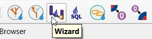

Data entry
==========

There are basically two ways:

* Data entry by constructing or digitizing in a TWW-project with the TWW-wizard or QGIS-tools itself
* Data entry in an external program or software and then importing the position and/or technical data into TWW e.g.:

   * coordinates from manholes from measurement
   * position and/or technical data from another GIS or CAD system
   * using data from the surveyor (e.g. property boundaries) as a basis for defining catchment borders
   * other

Data entry in TWW needs some understanding of the underlying data model `VSA-DSS <http://dss.vsa.ch>`_, but is supported with some great data collecting wizards and forms that link the different tables correctly together. Especially the linking of manholes and reaches to a complete sewer network is highly automated and can be controlled with the network following tool.

.. _wizard:

The TWW wizard
---------------

The TWW wizard helps digitizing manholes and reaches with just a few clicks.

To start with data entry select the TWW button **Wizard**.

On the left side bottom, **TWW Data Entry** window appears:

.. figure:: images/wizard_data_entry.jpg

Click **Start Data entry** to enter the edit mode.

Choose **Wastewater Structure** or **Reach**. Start adding new feature in vw_tww_wastewater_structure or vw_tww_reach.

There is no need to select the correct layer in the layers-window, you do not need to toggle editing or to choose the add feature tool.

When adding new **wastewater structure**, the wizard has no additional functionality. In the layer form configuration, the option **Reuse last entered value** defines for every field, if the last value will be used again or not.

When adding new **reach**, the wizard has some additional functionality:

* Snapping on wastewater nodes and other reaches is on, even if QGIS **Enable Snapping** is off.
* Snapping on nodes is always preferred to snapping on reaches.
* When the new reach snaps, then the obj_id_links are automatically entered in the fk_fields of the reach points.
* The **Reuse last entered value** - option of QGIS does not work in this view. But the standard-fields on the general-tab (and only those fields) do reuse the last entered value.

If you use another tool (e.g. the **Identify Features** tool) and then want to continue digitizing with the wizard, you can not select the wizard again. You have to click **Stop Data Entry** and then **Start Data Entry** and you can continue.

If you change from digitizing wastewater structures to digitizing reaches, it is recommended to stop and start data entry also. This saves the new manholes and enables the reaches to snap also on new digitized manholes.

.. note:: When digitizing, it is recommended to start with the point elements (wastewater structures such as manholes, special structures). Afterwards its easy to connect those points with line elements (channels with reaches).

It is possible to use the **Advanced Digitizing** tools together with the wizard.

QGIS standard tools
-------------------

To digitize in other layers than vw_tww_wastewater_structure or vw_tww_reach, you work with the standard QGIS tools:

* Select the layer you want to edit
* Toggle Editing if necessary
* Enable snapping if necessary
* Choose the add feature tool

It is also possible to use the standard QGIS tools with the two vw_tww-main layers. But there will be no automatic value in the fk-fields of the reach-points and no preferred snapping to wastewater nodes.
