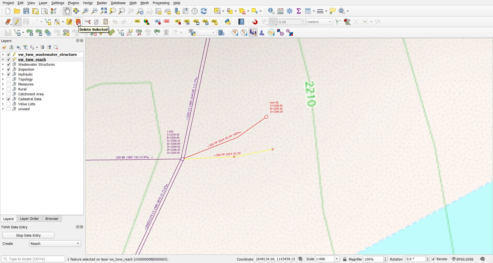
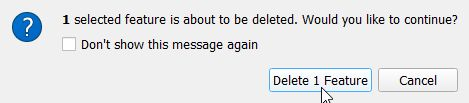
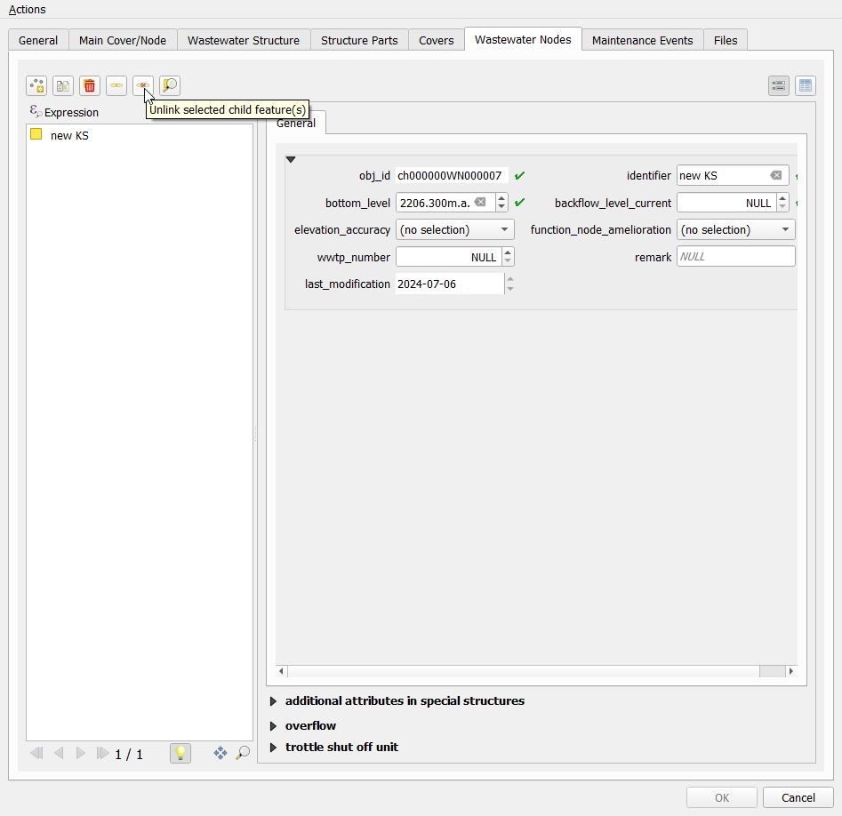
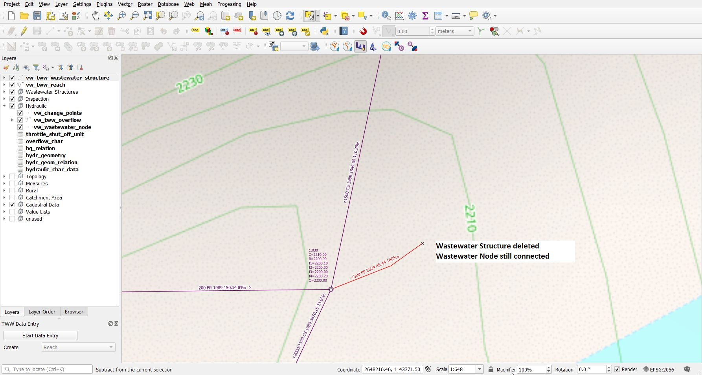
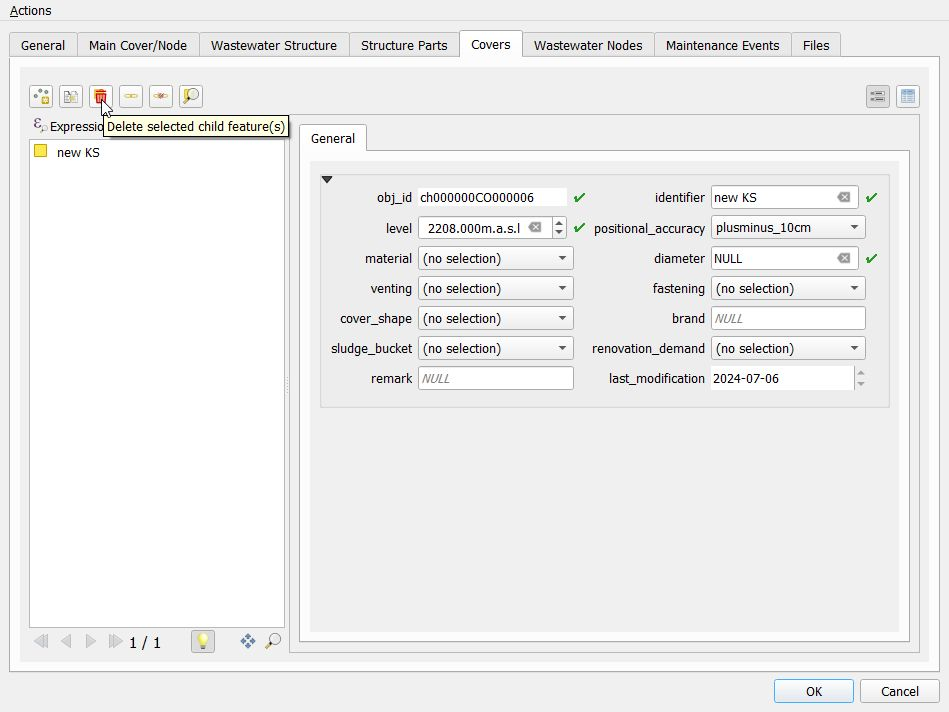
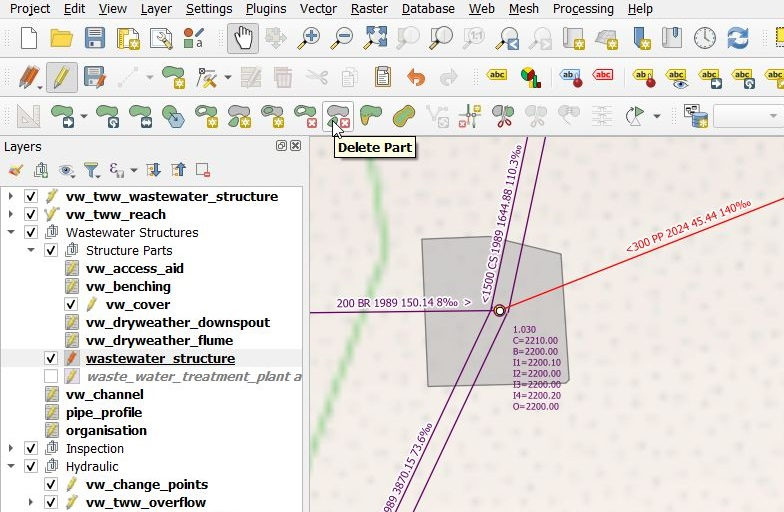
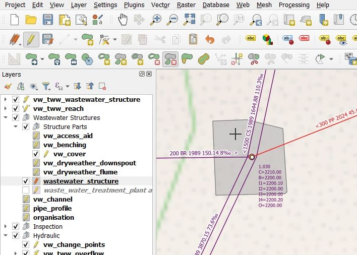

Deleting objects
================

You can delete point or line objects (with all associated objects) through the **vw_tww_(wastewater_structure/reach)** layers.
You can also pick and delete only a specific object (e.g. cover).

Delete Reach
------------

* Select **vw_tww_reach** and change to edit mode.

* Select the reach(es) you want to delete. You can click on an object or draw an area.

.. figure:: images/select_tool.jpg

* Use the top menu **Edit** --> **Delete Selected** to delete.

.. note:: The easiest way is to simply press the **Delete** key on your keyboard.
  Another way is to press the **Delete** button located in the **Digitizing toolbar**.

  .. figure:: images/delete_button.jpg

  Depending on how you customized QGIS the **Digitizing toolbar** may be hidden or located
  elsewhere.

* Deselect the edit mode and confirm changes to layer. All changes will be saved to database.

.. note:: Delete reach deletes also all connected structure parts (e.g. dryweather_downspout). The connected channel is only deleted if there is no other wastewater networkelement connected to the channel. If there are two reaches connected to one channel, the channel is only deleted if both reaches are deleted.

Delete Manhole or other Wastewater Structure
------------------------------------------------

* Select **vw_tww_wastewater_structure** and change to edit mode
* Select the objects (**manholes**, **special structures** etc.) you want to delete
* Use **Edit** --> **Delete Selected** to delete.
* Stop the editing mode and confirm changes to layer. All changes will be saved to database.

.. note:: Delete wastewater structures deletes also all connected structure parts (cover, access_aid etc) and all connected wastewater nodes. fk_wastewater_networkelement in reachpoints, that where connected to the node, are set to NULL.

Delete Wastewater Structure, but keep the wastewater_node and the connections to the wastewater_node
---------------------------------------------------------
First, you have to kill the connection between wastewater_node and wastewater_structure. Because the fk_wastewater_structure field is not visible in the wastewater_node feature attribut window (this field make no sense in other cases, where the form is also used), you have to follow this way:

* Select **vw_tww_wastewater_structure** and change to edit mode
* Use the **Identify Features** tool to open the form of the manhole you want to delete
* Switch to Wastewater Nodes tab
* Select the Node, that should not be deleted
* Use the button **Unlink selected child record(s)**

* Click **OK** and close the form window
The wastewater node is no no more part of the wastewater_structure

* Select the object (**manhole**, **special structure** etc.) you want to delete
* Use **Edit** --> **Delete Selected** to delete.
* Stop the editing mode and confirm changes to layer. All changes will be saved to database.

Delete Cover
-------------

* Select **vw_tww_wastewater_structure** and change to edit mode
* Select the object (**manholes**, **special structures** etc.) from which the cover is to be deleted
* Use the **Identify Features** tool to open the form
* Switch to the covers tab
* Select the cover(s) you want to delete
* Click the button **delete selected child features** to delete the covers

* Click save on the form
* Deselect the edit mode and confirm changes to layer. All changes will be saved to database.

Second way to delete a cover

* Select the **vw_cover** layer and change to edit mode
* Select the cover
* Use **Edit** --> **Delete Selected**
* Stop the editing mode

Delete Structure parts
----------------------

* Select **vw_tww_wastewater_structure** and change to edit mode
* Select the object (**manholes**, **special structures** etc.) from which a structure part is to be deleted
* Use the **Identify Features** tool to open the form
* Switch to the structure parts tab
* Select the structure part you want to delete
* Click the red x button to delete the structure parts
* Click save on the form
* Stop the editing mode and confirm changes to layer. All changes will be saved to database.

Delete detailed geometries
--------------------------

.. attention:: Deleting features directly from **wastewater_structure** (layergroup Wastewater Structures) will remove the complete wastewater structure from the database and not only the geometry of the wastewater structure!

* Select layer **wastewater_structure** and change to edit mode
* Activate the **Delete part** tool from the Advanced digitizing toolbar

* You get a cross-cursor. Click on the part you want to delete (there is no question if you really want... If you click, the part is deleted!)

* Stop the editing mode and confirm changes to layer. All changes will be saved to database.
