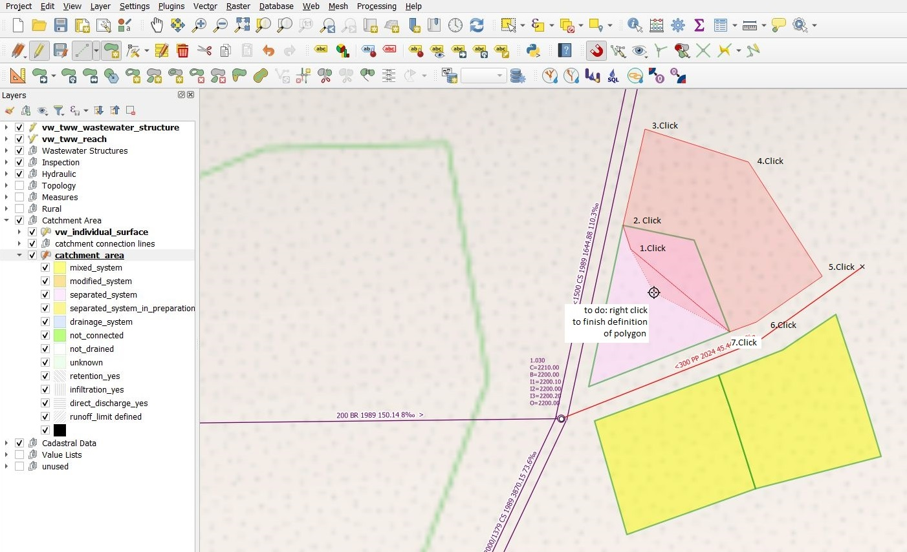
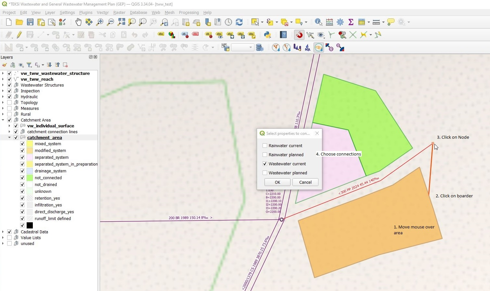

Digitizing Catchment Areas
===========================

General
-------

Catchments can be digitized with QGIS standard tool **Add Polygon Feature**.

.. figure:: images/qgis_standard_tools.jpg

Catchment areas should not overlap and can have 4 connections to wastewater nodes.

Digitizing
----------
* Select the **Enable Snapping** button

.. figure:: images/enable_snapping_button.jpg

* Open the **Advanced Configuration**, check the **catchment_area** layer and check the **Avoid Overlap** checkbox for the catchment_area layer

.. figure:: images/avoid_overlap.jpg

.. note:: New digitized catchment areas will not overlap with existing areas with this settings.

* Set the layer ``catchment_area`` into the edit mode.
* Use the **Add Polygon Feature** tool to digitize a new area.

* Start digitizing with left click and continue with left click for every vertex of the polygon

* Stop digitizing with right click

.. note:: Keep in mind, that the finishing point of the polygon is the last point where you **left** clicked.

* The **catchment_area** feature attributes window appears

* When finished editing attributes, click the **OK** button

.. note:: The new area does not overlap the old areas.

.. figure:: images/catchment_area_digitizing3.jpg

.. note:: To control the exact area of a selected polygon, see in the **Identify Results** window under **(Derived)**.

.. note:: To connect the area with wastewater nodes, see chapter :ref:`connect-wastewater-network-elements`.

Editing
-------

* You can edit existing areas with the **Identify features** tool.

.. figure:: images/identify_feature_tool.jpg

.. note:: There are ideas to have a menu in the feature attribute window, that allows you to copy all current-values to the planned-fields. Not realized yet.

Split Areas
-----------

* You can split existing areas with the **Split Features** tool.

* There is no need to select the area first. Left clicks to define the splitting line. Right click after having defined the last point of the splitting line.

Merge Areas
-----------

You can merge existing areas with the **Merge Selected Feature** tool.

* Selected the **catchment_area** layer and set it into the edit mode
* Select at least two areas you want to merge
* Click the ``Merge Selected Feature`` tool. -> The **Merge Features** windows appears.

.. figure:: images/merge_feature_attributes.jpg

* Choose which values will be taken from which old record. Control the values for fields **obj_id**, **identifier**. Then click **OK**. You can ignore the setting of field surface_area, because the surface_area of the combined area will be recalculated anyway.

.. attention:: If you select one of the records and click on the **Take attributes from the selected feature** button, then your manual changes will be reset. After using this button, you have to choose one of the values in the **identifier** field manually (otherwise **identifier** is skipped and the value will be NULL).

Connect Catchment area to Wastewater Network Nodes
--------------------------------------------------

You connect catchment areas with the tool **Connect wastewater networkelements** (it's the same tool to connect reaches and nodes described in the chapter Editing in TWW).

* It does not matter, which layer is selected
* The **catchment_area** layer has to be in edit mode
* Click the **Connect wastewater networkelements** button
* If you move the mouse over an catchment area near the border of the catchment area, it is marked: you can click to choose this record
* Move the mouse to the networkelement, to which the catchment area will by connected (again: selectable objects get marked) and click again

* A window appears, where you can choose, which connection(s) will be defined.

* If everything is ok, you will see a message in a blue bar on top of the map-window
* After saving, you will see the catchment connection line, if this layer is visible.

.. figure:: images/catchment_area_connect3.jpg

.. note:: In the VSA-DSS-Datamodel, it is possible to connect catchment_areas to wastewater nodes or to reaches. Because a lot of hydraulic calculation do not support connections to reaches, this tool in tww connects only to wastewater nodes and not to reaches.

.. note:: The tool does not check, if your choosen wastewater node is a part of the pwwf-network (primary network). It's only the user who decides, if a node is ok or not. If you are not sure, please check the **VSA Wegleitung Daten der Siedlungsentwässerung**, part **Erfassungsrichtlinien**

You can not connect multiple areas with the tool to a wastewater node at once. If you want to do so, you have to select the catchment areas, open the attribute table and then start the multi edit mode. There you can choose the wastewater node from the list of all nodes.

Do delete a connection to a wastewater node, you can edit the area with the **Identify features** tool.
