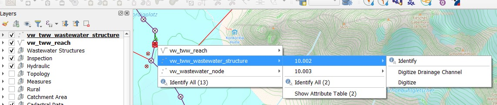
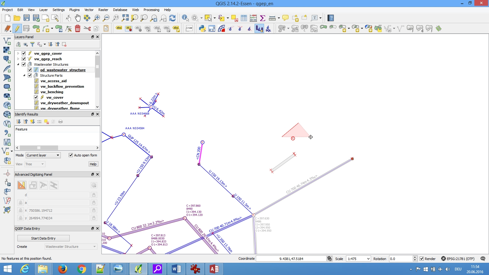
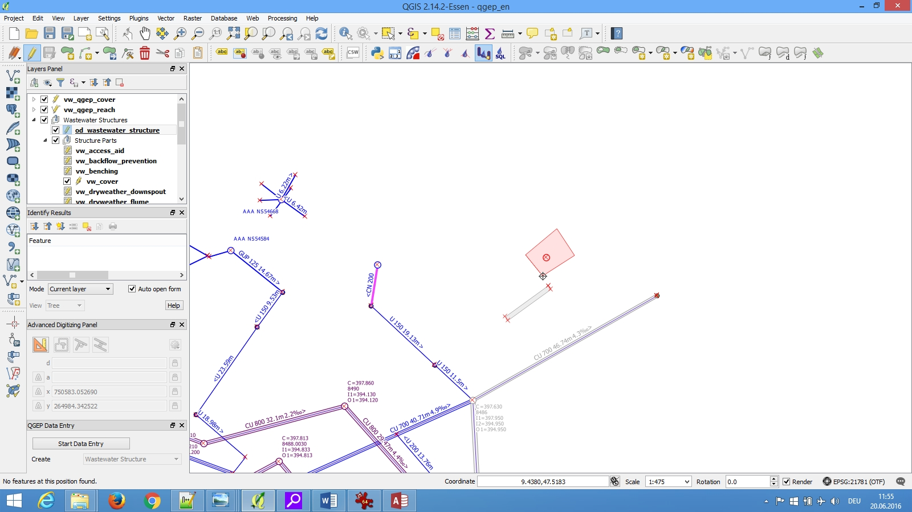
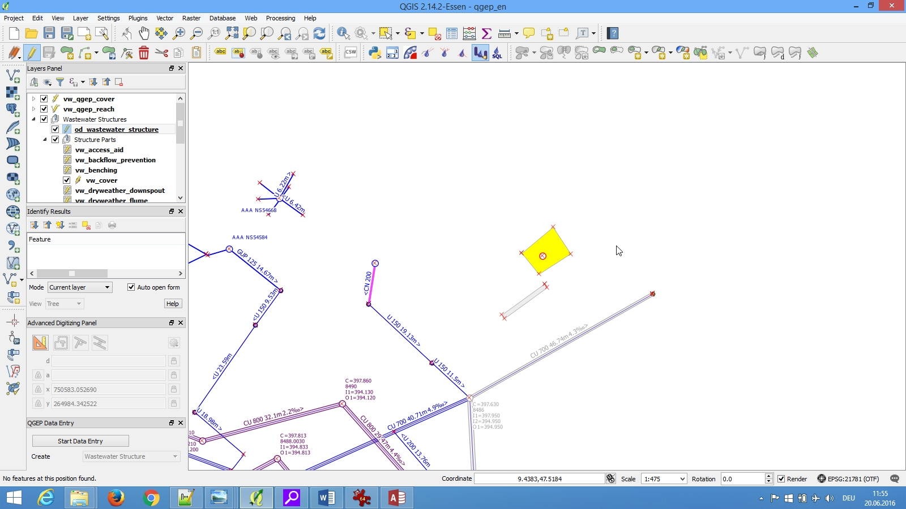
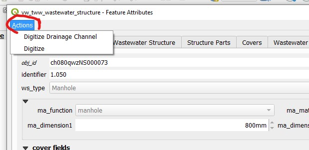
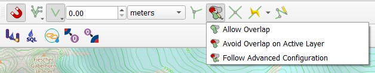

Digitizing detailed geometry
============================

General
-------

You can add a detailed geometry to waste water structures.

This is recommended for:

* Special structures and discharge points, because they are not normed structures like manholes,
  where you can define **dimension1** and **dimension2** to describe the geometry.
* Infiltration installations where **dimension1** and **dimension2** are not enough to describe the geometry

.. attention:: Detailed geometry is usually not used for manholes or channels!

Digitizing tool
---------------

* Right click the object you want to add a detailed geometry (not necessary to select a layer or to toggle editiing)
* if there are several objects: select the **vw_tww_wastewater_structure** layer if necessary, select the record
* Choose **Digitize**

* You can now start digitizing the polygon.

* Right click to stop.

An other way is to open the **vw_tww_wastewater_structure** feature attribute window with the info tool and then choose **Digitize** in the **Actions** menu of the window.

.. note:: If the geometry disappears after digitizing or if you get an message (like 'Add part'), you have probably tried to digitize over a catchment area (or an other polygon theme) and the layer has set the avoid overlap option in the snapping settings. Do change the avoid overlap settings.

