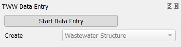
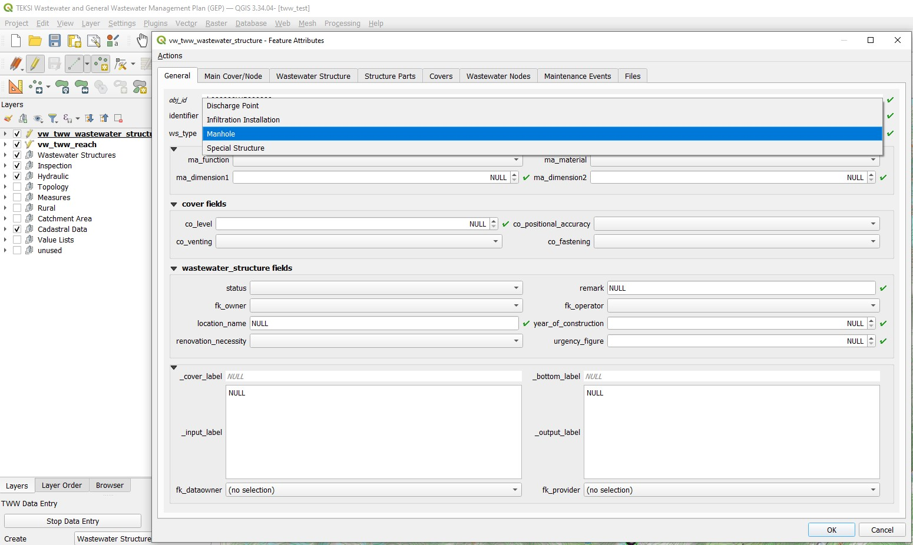
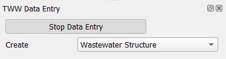

.. _digitizing-wastewater-structures:

Digitizing Wastewater Structures
=================================

General
-------

TWW has a wizard to correctly collect manholes and special structures. see the :ref:`wizard` chapter.

Select the **Wizard** button, then click **Start Data Entry** and choose **Wastewater Structure** in the pull down menu.

Digitizing
----------

Now the cursor changes to the digitizing symbol and you can select the location of the new point element.

Then the **vw_tww_wastewater_structure** form opens and you can start adding data in the **General** tab:

Select the ws_type you want (preselected is 'manhole'):

- manhole
- special_structure
- discharge_point
- infiltration_installation

Depending on the **ws_type**, you will have different fields and tabs in the form.

Then add the identifier (this is the attribute that will be displayed on the map).

.. note:: If you do not enter an identifier, TWW will enter the obj_id also as identifier (you can change later). As default, the identifier of the wastewater structure is also the identifier of the cover and of the wastewater node.

Add other attributes in the **General** tab.
You can also add attributes in the other tabs (Main Cover/Node, Wastewater Structure, Manhole, Structure Parts etc.).

.. note:: The idea of the **General** tab is, that in the normal digitizing process (95% of the manholes) the user has not to change the tabs to enter the attributes that are necessary.

.. attention:: You can not use **Actions** for digitize a detail geometry during creating a new manhole, because you have to save first the Wastewater Structure-record to the database before you can add a detail geometry. First safe the record.
You can add additional records Structure Parts or a second wastewater node in Tab Wastewater Nodes or Maintenance Events. But in the Tab Wastewater Nodes you will not see the main node, that is created with the new wastewater structure. You can see the main node in the tab Main Cover/Node. After saving the new wastewater structure, you will find two node in the tab Wastewater Nodes.

Click **OK** to close the form.

.. figure:: images/wizard_wastewater_structure_manhole_form_data_ok4.jpg

Save the information of this layer by stopping the data entry wizard.

You can re-edit your point object selecting the edit mode and then click with the info cursor on the object you want to edit.
If you do not select the edit mode, you can just look at the existing data.

For detailed information about editing see the :ref:`editing-data` chapter.

Further attributes and classes
------------------------------

When a wastewater_structure object is digitized, a series of steps take place in the background in the TWW database:

a) an new object in the class wastewater structure is added

b) a new object in the respective subclass [discharge_point, infiltration_installation, manhole, special_structure] is added and linked

c) a new cover object is added and linked to the wastewater structure

d) a new wastewater node object is generated (in wastewater network elements and its subclass wastewater nodes) and linked to the wastewater structure

e) the new cover and node are referred as main cover and main node of the wastewater structure

.. note:: The main node is the place, where the symbol of the wastewater structure is shown in TWW.

.. note:: delete this note?? To add a second cover or a second wastewater node to a wastewater structure, see the :ref:`editing-data` chapter.

Geometry synchronization
------------------------

The added feature's geometry defines the geometry of the connected tables like cover and wastewater node. The vw_tww_wastewater_structure-point itself has no Z value.
When the level of the cover `co_level` is entered, this value is adapted to the Z value of the cover's geometry. The bottom level of the wastewater node `wn_bottom_level` defines the Z value of the wastewater node's geometry.

.. note:: If a cover level changes, the Z value of the cover's geometry will be adjusted. When the geometry changes, the co_level attribut is adjusted as well. If both values change, the level takes precedence. On an insert it's like when both value change. Means the cover's geometry is set according to the cover level and if it's NULL, the Z value is set to NaN. The same situation is on editing the wastewater node directly.
