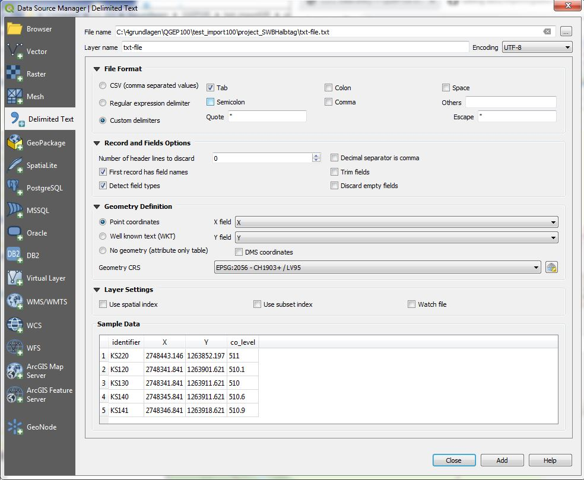
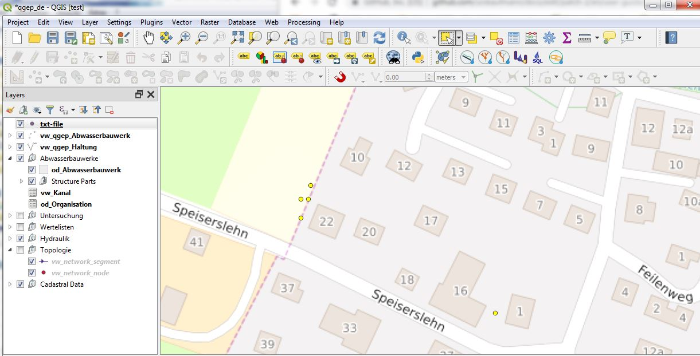
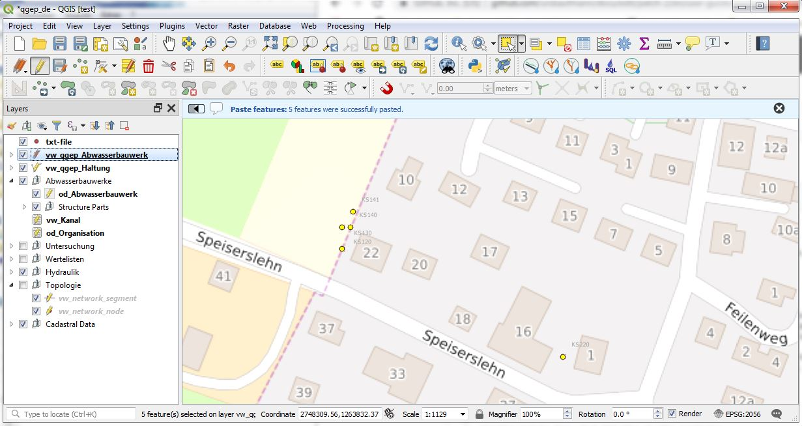
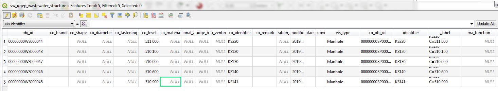

Importing data
==============

It is quite easy to import data (geometry and attributes) from an external software.
Here is a general description and a specific example.

General
-------

* You have to add the data you want to import as (vector) layer into the TWW project.
* The field names of the attributes have to be the same as the field names of the TWW Layer.
  If possible, prefer non limiting standard open formats like geopackage. When using shp-files, the 10 letters limitation of the dbf-format will fail to map correctly attributes (Alias field names do not work).
* If you have a translated project, be sure to take the English field names (not the translated name that you find as Alias of the field).
* If there is a field with value list, you have to use the code, not the plain text.
* If your fields are prepared as described above, then just copy and paste in the TWW-layer.

Why all these regulations: You copy the data not in the layer in our QGIS-project, but direct in the view or table in the postgresql-database. The database does not know anything about the configuration of the QGIS-project (alias names or value relations). In the database work just the triggers that are defined. So an obj_id will be created automatic.

If you want to import new values to existing records (e.g. update the field renovation_necessity of layer vw_tww_reach), you can not copy, because there are not new records. For these job you can work with QGIS fieldcalculator.

Example Importing manholes from a TXT-File:
-------------------------------------------
The pictures were created in QGEP, but the steps are still the same in TWW

* Change the field names to identifier, x, y, co_level

.. figure:: images/importdata_txtfile.jpg

* Open the txt-file with :menuselection:`Layer --> Add Layer --> Add Delimited Text Layer...`.

* You have now a vector-layer with your points in the TWW-project
* Select the points of the new layer

* Choose :menuselection:`Edit --> Copy Features`.
* Select the vw_tww_wastewater_structure layer and set it editable
* Choose :menuselection:`Edit --> Paste Features`.

.. note:: The ws_type is set as default to manhole. The identifier is used not only for the wastewater_structure, but also as cover_identifier and as wastewaternode_identifier.

Example Importing manholes with attributes:
-------------------------------------------

* Example to add additional attributes

.. figure:: images/importdata_txtfile2.jpg

* The field ws_type is an exception. Possible values are manhole, special_structure, infiltration_installation, discharge_point.
* For other fields with value lists you have to use the code.
* In the example above, the values for ma_function in the row discharge_point or special_structure has no effect.
