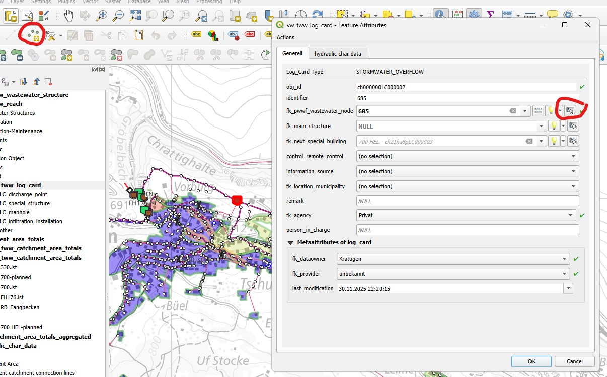
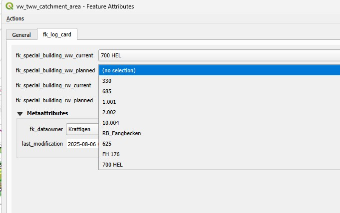
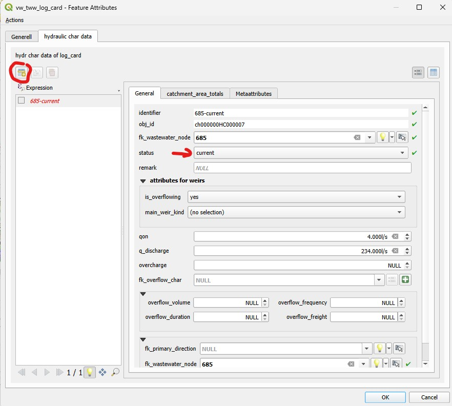

.. _log_cards:

Adding or Editing of Log Cards
=========================================

.. versionadded:: 2025.0

This represents a guide on how to add or edit Log Card data in TWW.

Creating / editing log_cards
-------------------------------

* Add a new point record in layer vw_tww_log_card by clicking anywhere an the map with the QGIS Add Point Feature -Tool.
* Select the wastewater_node of the log_card on the map.
* Do not try editing the identifier of the log_card: the identifier will be set by default equal to the identifier of the wastewater_node.
* Select fk_agency (is mandatory because this value is mandatory in DSS-mini).
* Choose OK.

Connect the catchment_area to the log_card
------------------------------------------

The database is now ready to connect the catchment_area-records to the log_card.
In vw_tww_catchment_area.fk_special_building_* are log_cards selectable, that belong to a special_structure. Use multiedit or field-calculator to edit the fk_special_building-fields.

Control the connected catchment_area in layer ``vw_tww_catchment_area_totals`` (polygon)
----------------------------------------------------------------------------------------

The connected catchment_areas with fk_special_building_ww_current will be displayed in layer vw_tww_catchment_area_totals (polygon) after clicking the TWW-SQL-Button (Refresh network topology).
The fields of this layer (population, surface_area,...) are not calculated automatically in the actual version (2025.0.2). Use statistic functions to get the necessary values.
In version 2025.0.2 is no visualization of the other connections (fk_special_building_ww_planned or fk_special_building_rw_current/planned).

Edit hydraulic_char_data
--------------------------

To edit the hydraulic_char_data, edit again the record in layer vw_tww_log_card.
In Tab hydraulic char data add a new record and choose a status.
Identifier of hydraulic_char_record is set autmatically to identifier of log_card-status (problem: if the wastewater_node_identifier is to long -> log_card.idenitifer is long -> hydraulic_char_data is too long!).

The fields that are editable depend on the function of the special_structure: pump-attributes are only visible for pumps, weir-attributes (also overflow_results) are only visible for special_structures with overflow.

Edit catchment_area_totals
--------------------------

Also the catchment_area_totals are edited in the record in layer vw_tww_log_card. Select the hydraulic char data, use tab catchment_area_totals and add a new record. Identifier should be set to identifier of hydraulic_char_data. The values has to be written manually actually (2025.02).

.. figure:: images/new_catchment_area_totals.jpg
