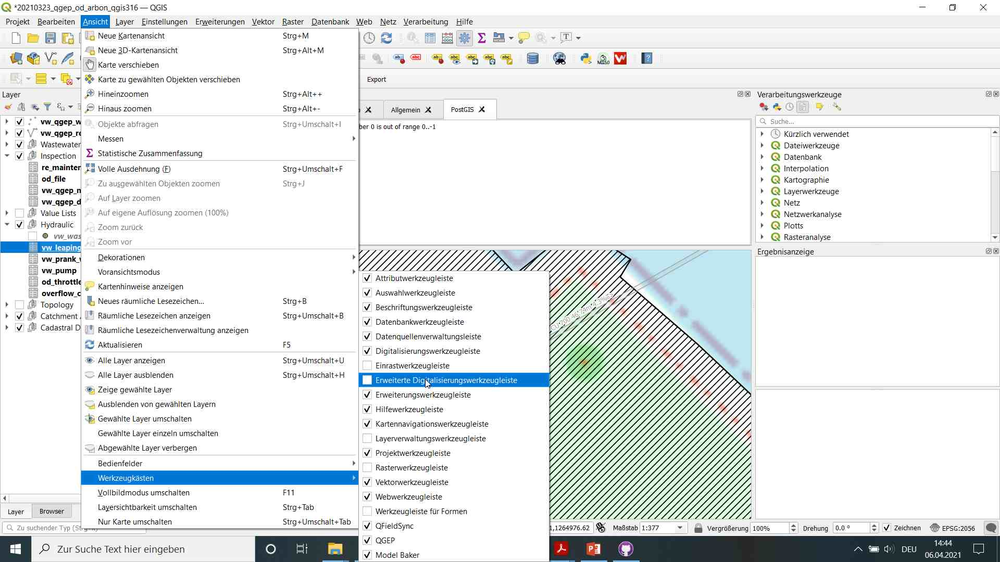

.. _moving-covers-with-reaches-and-wastewater-nodes:

Moving Wastewater Structures with Reaches, Covers and Nodes
===========================================================

This represents a guide on how to move wastewater structures with reaches and wastewater nodes compared to just moving the cover in TWW.

General
------------

It's not unusual, that manholes are digitized the first time with low precision. Later the manholes are measured, and there is the need, to move the whole wastewater structure (means cover(s), node(s) and reachpoints of all reaches) to the measured point.

There are two tools to move a manhole: **Vertex Tool** and **Move Feature** Tool. And there is a very important option in the **Snapping Toolbar**: **Enable Topological Editing**.

.. figure:: images/tools_moving.jpg

**Vertex Tool** and **Move Feature** work similar for (single)-point layers.

Because with DSS-datamodel, cover, wastewater node and reachpoints are connected not by location, but by foreign keys in the database, TWW is prepared to move cover(s), node(s) and reachpoints (and therefore also reaches) together by the same distance. This means, it's better not to enable topological editing in several cases.

.. note:: You need to turn on the advanced digitizing toolbar in your project to be able to select the **Move Feature** tool.

Moving a manhole
------------
* Select the **vw_tww_wastewater_structure** layer
* Set the layer to edit mode
* Select the **Move Feature** tool (standard QGIS tool in the advanced digitizing toolbar) or the **Vertex Tool**
* Deselect the button **Enable Topological Editing**

.. figure:: images/moving_wws_before.jpg

In this example, the manhole has one cover, two wastewater nodes, four reaches that end/start at the nodes places and one reach with a gap to the connected node. There is also a detail geometry.

* Left Click one the wastewater_structure point you want to move and left click again at the new place.

'1.070' manhole moved. Cover, 2 nodes and all 5 reachpoints (reaches) are moved to a new place. The distance between the points is still the same.
The detail geometry does not move (layer wastewater_structure in layergroup Wastewatser Structures). The detail geometry must be moved extra with the **Move Feature** tool. There is in the moment no good help, to do this automatically.

* To show the move, it's a good way to set the **Topology** layers visible:

.. figure:: images/moving_wws_manhole1topology.jpg

* To update the topology, click on the TWW - **SQL** Button

.. figure:: images/moving_wws_manhole1topologynew.jpg

.. note:: Reaches, that are connected to one of the moved reaches, are still connected with the foreign key, but did not move. You have to corrected manually if necessary.

Moving a cover / a node
------------
To move just a cover or just a node, you work with the specific layer:
Cover: Layergroup Wastewater Structures / Structure Parts, layer vw_cover
Nodes: Layergroup Hydraulic, layer vw_wastewater_node

* Select the specific layer
* Set the layer to edit mode
* Select the **Move Feature** tool (standard QGIS tool in the advanced digitizing toolbar) or the **Vertex Tool**
* Deselect the button **Enable Topological Editing**
* Left Click one the cover/node point you want to move and left click again at the new place.
* To update the topology, click on the TWW - **SQL** Button (not necessary when moved just covers).

Moving a reachpoint
------------
There is no reachpoint layer in the TWW-project. You edit reachpoints as part of the reach in layer **vw_tww_reach**.

* Select the **vw_tww_rach** layer
* Set the layer to edit mode
* Select the **Vertex Tool** (the Move Feature Tool moves the whole reach)
* Deselect the button **Enable Topological Editing**
* Left Click one the start- or endpoint of the reach you want to move and left click again at the new place.
* To update the topology, click on the TWW - **SQL** Button

.. note:: Set the layer **Topology**/**vw_network_node** visible to see the reachpoints location (not there attributes).

Video Tutorial (outdated)
--------------

* See `this video tutorial (version QGIS 2) <https://vimeo.com/162978741>`_
