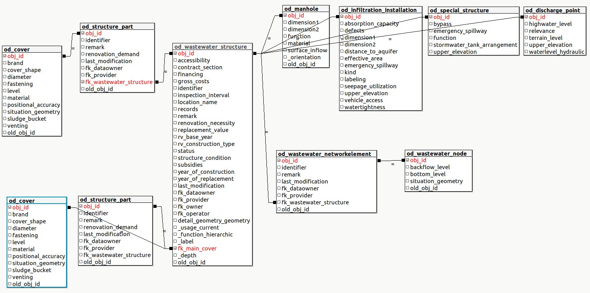
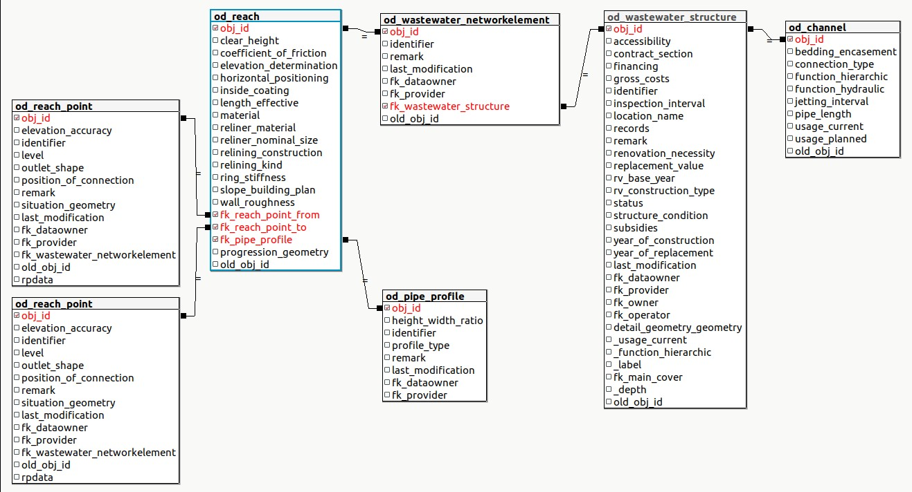

.. _layer-explanation:

Layers explanation
==================

Main layers
-----------

TWW is constructed around two main layers :

 * Wastewater structures ``tww_app.vw_tww_wastewater_structure``
 * Reaches ``tww_app.vw_tww_reach``

Wastewater structures ``tww_app.vw_tww_wastewater_structure``
^^^^^^^^^^^^^^^^^^^^^^^^^^^^^^^^^^^^^^^^^^^^^^^^^^^^^^^^^^^^^^

Main layer for manholes, special structures, infiltration installations, discharge points (and wastewater treatment plant (wwtp) structure). Creating a new record in this layer always creates a new wastewater structure, a new cover and a new wastewater node. In the edit form, you have access to a lot of the related tables (e.g. structure parts, maintenance events).

Even if there are several covers or wastewater nodes, there is just one point for every wastewater structure in this layer. By default, the position of the wastewater node created first is used as the point coordinate.

.. attention:: Do not export this point coordinates as covers. Use the layer vw_cover for this.

Reaches ``tww_app.vw_tww_reach``
^^^^^^^^^^^^^^^^^^^^^^^^^^^^^^^^^

Main layer for line-wastewater structures (channels). Creating a new record in this layer always creates a new reach and a new channel. In the edit form, you have access to a lot of the related tables (e.g. structure parts, maintenance events).

Wastewater Structures
---------------------

Wastewater Structures Details ``tww_app.wastewater_structure``
^^^^^^^^^^^^^^^^^^^^^^^^^^^^^^^^^^^^^^^^^^^^^^^^^^^^^^^^^^^^^^

This layer shows and enables you to edit the detailed geometries of wastewater structures. You can add a new detailed geometry using the layer `vw_tww_wastewater_structure` action called digitize detailed geometry.

See `digitizing detailed geometries <../digitizing/digitizingdetailedgeometry.html>`_ for more information.

Structure Parts ``tww_app.structure_part``
^^^^^^^^^^^^^^^^^^^^^^^^^^^^^^^^^^^^^^^^^^

Cover is the only structure part with a point-geometry itself. All other structure parts are just linked to their wastewater structures and should by only edited by the main layers (`vw_tww_wastewater_structure` and `vw_tww_reach`).

Covers ``tww_app.vw_cover``
^^^^^^^^^^^^^^^^^^^^^^^^^^^

Use this layer to change the situation of some specific cover (and not the whole wastewater structure) or to add a new cover to an existing wastewater structure. You can add an additional covers in the covers-tab of the `vw_tww_wastewater_structure` too. Additionally, use this layer to show the detailed position of the covers (e.g. in network_plan or pipeline_registry) or to export the cover positions `situation_geometry`.

Channels ``tww_app.vw_channel``
^^^^^^^^^^^^^^^^^^^^^^^^^^^^^^^

The channel-class has no geometry and is therefore mostly changed in the vw_tww_reach layer.

Organisations ``tww_od.organisation``
^^^^^^^^^^^^^^^^^^^^^^^^^^^^^^^^^^^^^^

organisation contains the organisation that you can select in attributes like fk_dataowner, fk_operator, fk_provider, fk_owner, etc.

In order to use the organisations efficiently, one can flag an organisation as active using the flag ``tww_active``. This flag filters the organisations accessible from the QGIS project.

 .. figure:: images/od_organisation.jpg

This table is today a little bit hidden in the wastewater_structures group (but it is not only related to wastewater structures).

Maintenance events ``tww_app.vw_tww_maintenance``
--------------------------------------------------

Maintenance events can be created through the view tww_od.vw_tww_maintenance.

These maintenance events are used in the maintenance tabs in the main tables. They can be linked to one or several wastewater structures.

See `editing maintenance events <../editing/maintenance_events.html>`_ for more information.

Value Lists ``tww_vl.*``
-------------------------

These value lists are defined in the VSA-datamodel. Do not change.

Hydraulic
---------

Wastewater nodes ``tww_app.vw_wastewater_node``
^^^^^^^^^^^^^^^^^^^^^^^^^^^^^^^^^^^^^^^^^^^^^^^

Use this layer to change the situation of one selected wastewater node (and not the whole wastewater structure) or if you want to add a new wastewater node to an existing wastewater structure. You can add additional wastewater nodes in the wastewater nodes-tab of the `vw_tww_wastewater_structure` too.

Overflow tables ``tww_app.vw_tww_overflow``
^^^^^^^^^^^^^^^^^^^^^^^^^^^^^^^^^^^^^^^^^^^^

These tables are connected to wastewater nodes. In the project-file template (Version 8.0, 4.6.2020) are no relations defined for these tables.

Topology
--------

Nodes ``tww_app.vw_network_node`` and segments ``tww_app.vw_network_segment``
^^^^^^^^^^^^^^^^^^^^^^^^^^^^^^^^^^^^^^^^^^^^^^^^^^^^^^^^^^^^^^^^^^^^^^^^^^^^^^^

These two layers are used by the tww-extension for the profile and the network-following functionalities.
Use the tww_app.vw_network_segment layer to show the flow direction, if you use a markerline (filled_arrowhead) as symbol.

See `connect wastewater network elements <../editing/connect_wastewater_network_elements.html>`_ for more information on how to create and maintain a good Topology.

Catchment ``tww_od.catchment_area``
------------------------------------

Main layer to digitize and edit the catchment_areas.
