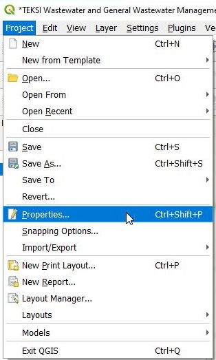
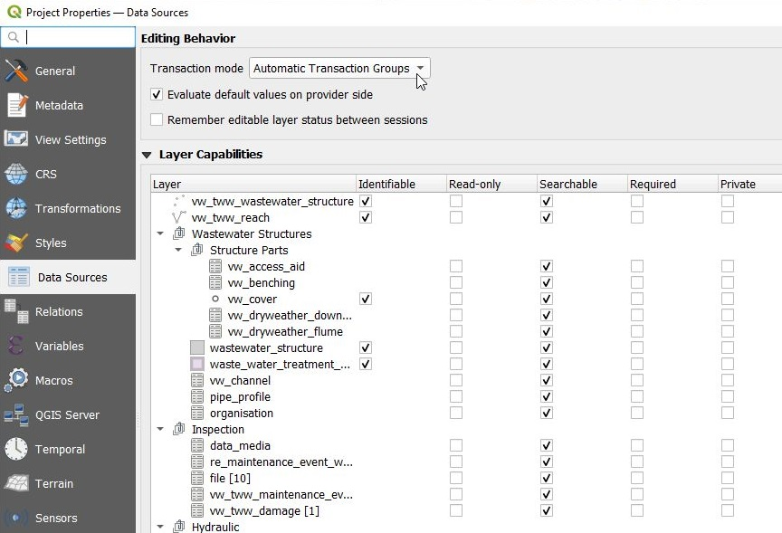
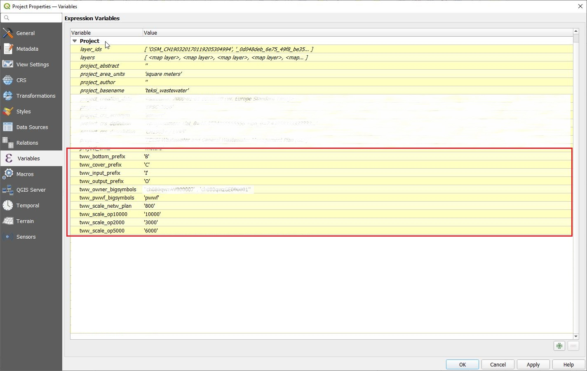
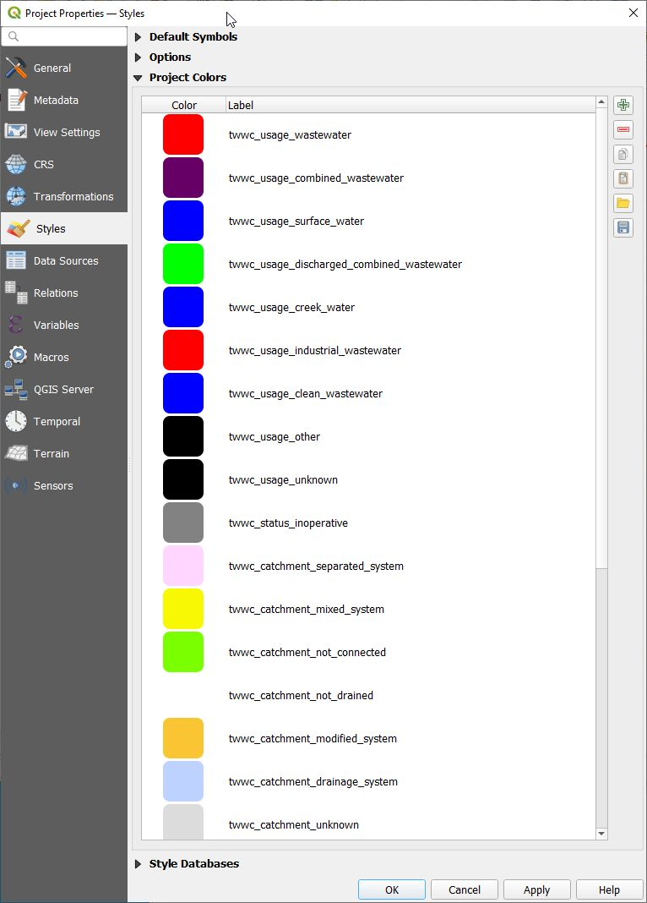
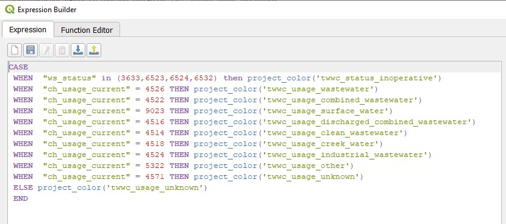
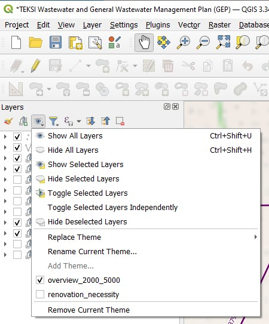
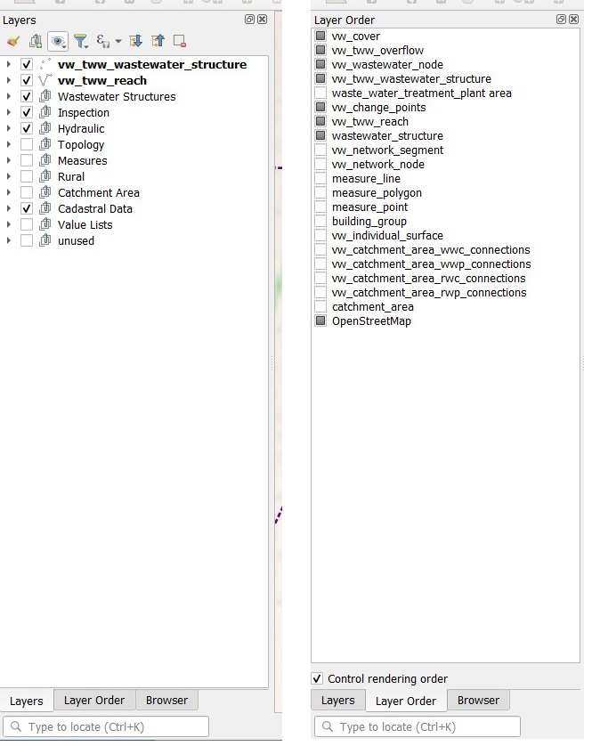

TWW-project properties and settings
===================================

Project Properties
------------------
There are several relevant properties in a TWW-project:

Data Sources
^^^^^^^^^^^^
Main Settings:

* Transaction mode is recommended to be set on **Automatic Transaction Groups**

* **Evaluate default values on provider side** has to be checked

Relations
^^^^^^^^^^^^
Relations are necessary for the Feature Attributes Windows to reference to connected tables (e.g. you can edit connected maintenance_events in Feature_Attribut window in vw_tww_reach).
Where possible, value relations widgets are used instead of project relations. Value Relations are used for Value Lists, but also for organisations and for pipe_profiles.

**Value Relations** works perfect also with Multiedit, but can be slow if there are a lot records in the related table or list. Does not provide the ability to link a record on the map (e.g to define a manhole-catchment area-connection).

**Project relations** allows you to fully use the relation between two objects (parent and child(s)) and to link a record on the map. Is faster with large datasets.

.. attention:: Using Multiedit with projet relations widgets encounters yet some bugs on QGIS side, handle with care when altering theses attributes. (as of today with QGIS 3.34.4)

.. note:: If there is a good advantage to work with Multiedit, it's a good idea to define a style, that has no relation-field in the Feature Attributs window.

.. note:: Project relations are not editable (yet) and are not copied when dealing with other .qgs projects.

Variables
^^^^^^^^^^
The TWW-project uses project variables to simplify some of QGIS-functionalities. These approaches are not TWW specific and can be used also in other QGIS-projects.

In the project used variables have names that start with "tww".

**Variables for label translations**

TWW uses 4 variables to translate the labeling of manholes into the desired language. Without changing the variables, the levels are labeled with "english" letters: "C" for cover level, "I" for Input level, "O" for Output level, "B" for Bottom level. In a german project, you will change these variables to "D" (Deckel), "E" (Einlauf), "A" (Auslauf) and "S" (Sohle) to get the expected labels.

Background: the database uses always the "english" letters to write the _*_label fields in vw_tww_wastewater_structure. In the label-definition of vw_tww_wastewater_structure is a "replace" formula, that change the "english" letter to the letter defined in the project variables

'concat(_label, replace(_cover_label,'C',@tww_cover_prefix), replace(_bottom_label,'B',@tww_bottom_prefix), replace(_input_label,'I',@tww_input_prefix), replace(_output_label,'O',@tww_output_prefix))'

**Variables to define symbols size**

Often are symbols big or small or with different labels depending on attributs (primary or secondary network, owner of the wastewater_structures). Because there are also differences in the languages (pwwf / paa / oap ...), it's one way, to define in a variable, which value has big symbols. You can use this variable in rule based symboldefinitions or in the size definition of symbols or in value definition of labels etc. in differnet layers.

**Variables to define the scale, where the plansymbols change**

In VSA-DSS are 5 plan-types defined (pipeline_registry, network_plan, 3 overview maps). Every plan has other rules for labeling and symbols. Therefore you have to define scales, where to show which plan-type. And these scales are used in reach labeldefinition, in reach symboldefinition, in manhole labeldefinition and manholesymboldefinition (and with several styles in every layer). If you work with variables, you can easy change the scales.

Example in vw_tww_reach:

.. figure:: images/properties_variables_example1.jpg

Styles/Project Colors
^^^^^^^^^^^^^^^^^^^^^
The color for mixed_wastewater (as example) is used in vw_tww_reach symbols and labels, in vw_tww_wastewater_structures symbols and labels. To change the color (just a different shade of purple) is a lot of work and may result in errors, if you do not use project colors.
In the TWW-project are project colors defined for all value of valuelist

* channel.usage(_current/planned)
* wastewater_structure.status.inoperative
* catchment_area.drainage_system(_current/planned)
* wastewater structure.structure_condition/renovation_necessity (also useable for condition_score and urgency_figure).

To change a projectcolor, go to project/properties/styles/project color, double click the color to be changed and define your color. Then click OK and do not forget to click **Apply**.
You can export and import Projectcolors in a GPL-File.

Example in vw_tww_reach:

Map Themes
----------
There are two map themes defined in the TWW-project as an invitation to use this great feature of QGIS to toggle between different layer-styles.

It is important to understand, what map themes do:

A map theme is a snapshot of the current map legend that records:

* the layers set as visible in the Layers panel

* and for each visible layer:

  * the reference to the style applied to the layer

  * the visible classes of the style, ie the layer checked node items in the Layers panel. This applies to symbologies other than the single symbol rendering

  * the collapsed/expanded state of the layer node(s) and the group(s) placed inside

Layer Order
-----------
TWW uses a lot of layers. Therefore it's a good idea to have the layer organised in a logical way.

The layer order panel enables to manually define the order of the layers displayed on the map canvas without altering it in the layer panel.
It is strongly relevant when digitizing with QGIS standard tools and can be very handy in many situations.

